# Business Use Cases: Sales to Product Group Interactions
## ElectroRent AI Product Advisor MVP

**Project**: ElectroRent AI Product Advisor MVP  
**Document Version**: 2.0 (Enhanced with Discovery Calls - Mermaid Diagrams)  
**Date**: November 2025  
**Stakeholders**: Sales Team, Product Group, Management

---

## Executive Summary

This document outlines real-world business use cases derived from discovery calls with the ElectroRent Product Group and Sales team. These scenarios represent the core interactions between Sales and Product Group that the AI Product Advisor solution will automate and enhance. The system reduces escalations to Product Group by 70-80% while enabling Sales to serve customers faster with accurate, data-driven recommendations.

---

## Understanding the Business Context

### Current Process Flow

**Current State Characteristics:**
- Response Time: 30 minutes to 4 hours
- Multiple Escalations: Sales to PG to Warehouse to Supplier
- Information Silos: Data scattered across Perfect, D365, Salesforce
- Customer Wait: Competitor calls during delay
- Resource Cost: Senior staff research for routine queries

---

### Desired Future State with AI Product Advisor

**Future State Characteristics:**
- Response Time: Seconds to minutes
- Single Interface: One chatbot for all queries
- Integrated Data: Real-time access to all systems
- Customer Satisfaction: Immediate answers
- Resource Efficiency: PG focuses only on complex decisions

---

## Core Use Cases from Discovery Calls

### Product Selection Scenario Breakdown

During discovery calls, Product Group identified three core ways customers express their needs:

---

#### Type 1: Specific Equipment (Part Number Known)

**Customer Says**: "Do you have model XYZ-1000 available?"

**Resolution Path**:

---

#### Type 2: Application/Test Type

**Customer Says**: "We need to test for RF interference in the 2-4 GHz band while driving around"

**Resolution Path**:

**Key Business Rule**: 
"You can UP-sell bandwidth (customer needs 13 GHz, we offer 16 GHz) but CANNOT DOWN-sell bandwidth (customer needs 13 GHz, we only have 8 GHz = no match)"

---

#### Type 3: Problem Description (Vague)

**Customer Says**: "We're having signal issues with our test setup"

**Resolution Path**:

---

## Real-World Use Case Examples

### USE CASE 1: Power Supply Substitution Decision

**Actors**: Sales Rep (Sarah), Product Group (John), Customer (General Dynamics)

**Scenario**: Customer needs 1 kV DC, 25 amps power supply for circuit testing

#### What Happened (Current State)

**Timeline**: 2-3 hours | **Outcome**: Lost deal to competitor

---

#### With AI Product Advisor (Future State)

**Timeline**: 10-15 seconds | **Outcome**: Deal closed immediately

---

### USE CASE 2: Oscilloscope with Probes Package Deal

**Actors**: Sales Rep, Product Group (John), Customer (Tech startup)

**Scenario**: Customer needs 13 GHz oscilloscope for PCI Express 5 testing

#### Decision Tree for Complex Configuration

---

### USE CASE 3: Multi-Location Inventory Search

**Actors**: Sales Rep (US-based), Product Group, Customer (International)

**Scenario**: US Customer needs equipment, not available in US warehouse

#### Geographic Prioritization Logic

---

## Business Rules & Escalation Triggers

### The Business Rules Framework

---

## Key Data Points Required

### Data Dependency Map

---

## Pricing Awareness & Transparency

### Real-Time Pricing Flow

### Equipment Recommendation Display

---

## Follow-Up Questions Strategy

### Smart Questioning System

---

## Success Metrics Overview

### Response Time Improvement

---

### Escalation Reduction

```mermaid
graph LR
    subgraph Before["BEFORE: 40-60 Escalations/Day"]
        B1["Type 1:<br/>20% escalation"]
        B2["Type 2:<br/>60% escalation"]
        B3["Type 3:<br/>85% escalation"]
    end
    
    subgraph After["AFTER: 12-18 Escalations/Day"]
        A1["Type 1:<br/>10% escalation"]
        A2["Type 2:<br/>40% escalation"]
        A3["Type 3:<br/>85% escalation<br/>→ Refer to AE"]
    end
    
    Before --> Compare["70% Overall<br/>Escalation<br/>Reduction"]
    After --> Compare
    
    style Before fill:#ffcdd2
    style After fill:#c8e6c9
    style Compare fill:#bbdefb
```

## Product Taxonomy

### ElectroRent Product Hierarchy

---

## Appendix: Quick Reference Guide

### When to Escalate Decision Tree

---

**End of Document**

